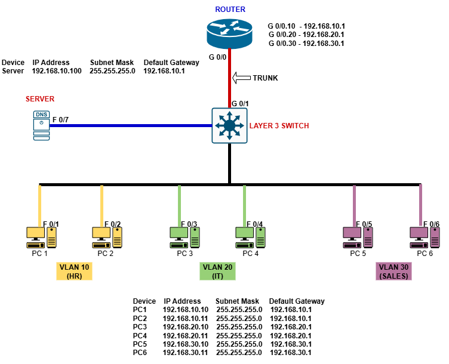
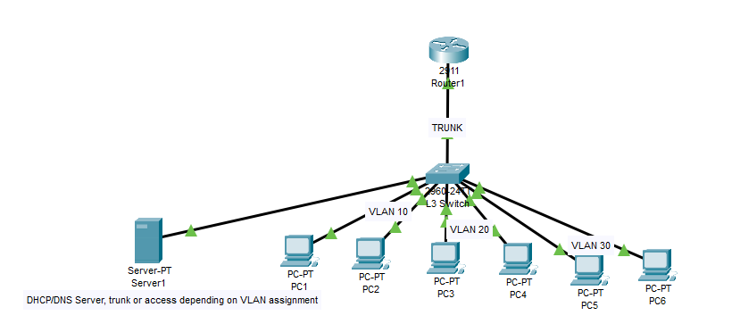
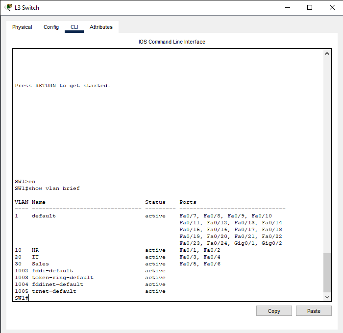
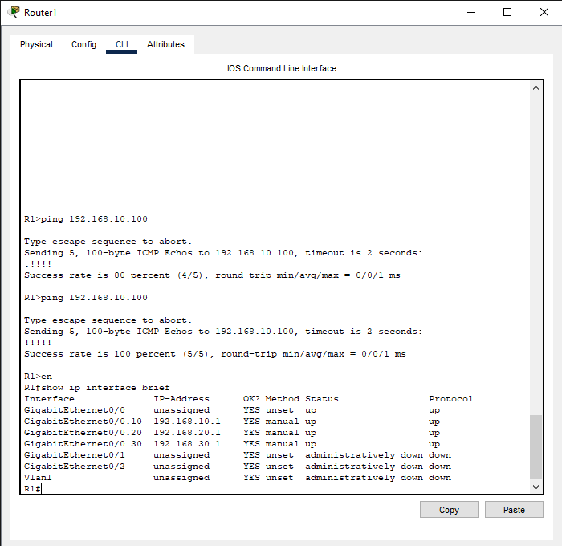
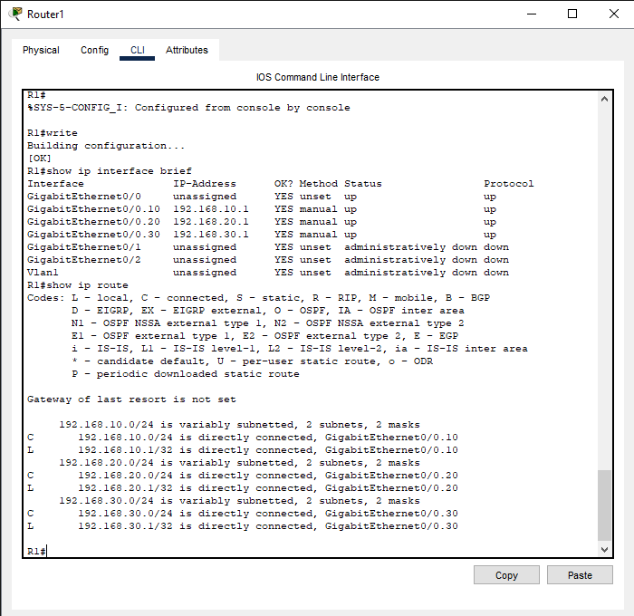
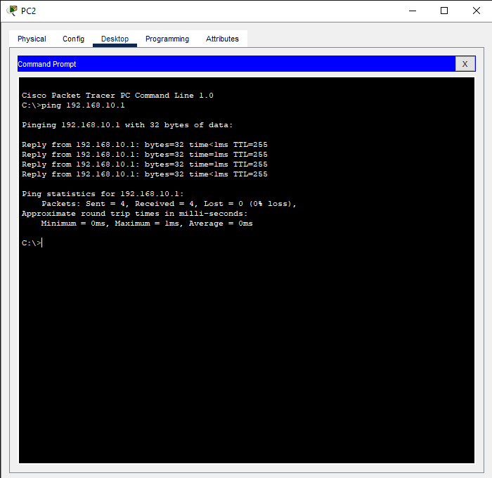
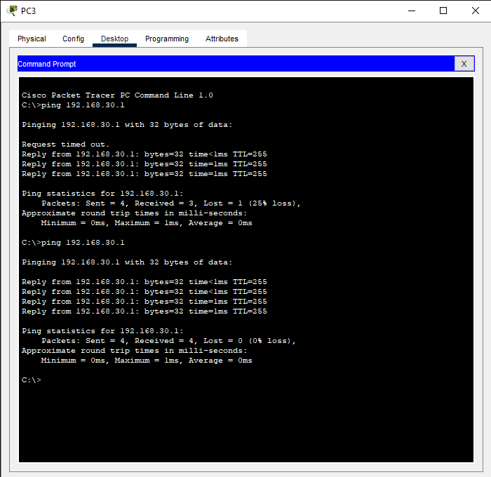
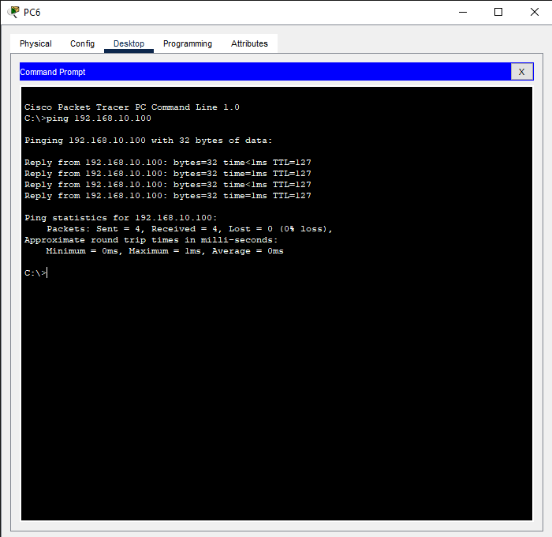

# Project 1: Enterprise VLAN & Inter-VLAN Routing Setup

---


# 🏢 Enterprise VLAN & Inter-VLAN Routing Setup

_A Cisco Packet Tracer lab demonstrating VLAN segmentation, trunking, and router-on-a-stick inter-VLAN routing for enterprise networks._


Table of Contents

1.  [Project Overview](#📘project-overview)
2.  [Project Objectives](#project-objectives)
3.  [Network Topology](#network-topology)
4.  [IP Addressing Table](#ip-addressing-table)
5.  [Lab Steps](#lab-steps)
6.  [Device Configuration](#device-configuration)
     - [Switch Configuration](#switch-configuration)
     - [Router Configuration](#router-configuration)
     - [DHCP Server Configuration](#dhcp-server-configuration)
     - [PC Configuration](#pc-configuration)
     - [Server Configuration](#server-configuration)
7.  [Verification Commands](#verification-commands)
8.  [Folder Structure](#folder-structure)
9.  [Learning Outcomes](#learning-outcomes)
10. [Repository Info](#repository-info)


---
## 📘 Project Overview

This lab demonstrates a **realistic enterprise network** with multiple VLANs and inter-VLAN routing using **router-on-a-stick**.  
The network includes a central switch, a router with subinterfaces, multiple PCs in different VLANs, and a server.  
It highlights key **CCNA skills**: VLAN creation, trunking, inter-VLAN routing, DHCP, and IP addressing.

---
## 🎯 Project Objectives:

- Configure VLANs and assign access ports.
- Configure a trunk port between switch and router.
- Configure router-on-a-stick subinterfaces for inter-VLAN routing.
- Verify connectivity between VLANs and to a central server.
- Demonstrate Layer 2 and Layer 3 network communication.

**Real-world Scenario:**

The company has three departments: HR, IT, and Sales. Each department needs its own VLAN for traffic segmentation. 
All PCs should communicate internally while maintaining proper gateway configuration, and DHCP automates IP assignment.

**Important Note:**

“The server resides in VLAN10 (HR). 
Other VLANs access the server via router-on-a-stick inter-VLAN routing, demonstrating proper Layer 3 routing in an enterprise network.”

---
## 🖥️ Network Topology

Router: 1 (R1)

Switch: 1 Layer 3 Switch (SW1)

PCs: 6 (2 per department)

Server: 1 (DHCP & DNS)

Topology Layout:


> 🧩 See `topology/enterprise-vlan-intervlan-lab.png` for network diagram.  
> Drawio design available at: `drawio/enterprise-vlan-intervlan-lab.drawio`


🗂️ **Device Connection Table** 

| Device | Interface | Connected To | Notes                                                         |
| ------ | --------- | ------------ | ------------------------------------------------------------- |
| R1     | G0/0      | SW1 G0/1     | Trunk link for router-on-a-stick                              |
| SW1    | G0/1      | R1 G0/0      | Trunk link carrying VLANs 10, 20, 30                          |
| SW1    | Fa0/1     | PC1          | HR VLAN 10                                                    |
| SW1    | Fa0/2     | PC2          | HR VLAN 10                                                    |
| SW1    | Fa0/3     | PC3          | IT VLAN 20                                                    |
| SW1    | Fa0/4     | PC4          | IT VLAN 20                                                    |
| SW1    | Fa0/5     | PC5          | Sales VLAN 30                                                 |
| SW1    | Fa0/6     | PC6          | Sales VLAN 30                                                 |
| SW1    | Fa0/7     | Server       | DHCP/DNS Server, trunk or access depending on VLAN assignment |

---
## 🧮 IP Addressing Table

| Device / Interface    | IP Address     | Subnet Mask   | Default Gateway | VLAN / Notes                             |
| --------------------- | -------------- | ------------- | --------------- | ---------------------------------------- |
| **Router R1** G0/0.10 | 192.168.10.1   | 255.255.255.0 | -               | VLAN 10 HR (Router-on-a-stick)           |
| **Router R1** G0/0.20 | 192.168.20.1   | 255.255.255.0 | -               | VLAN 20 IT                               |
| **Router R1** G0/0.30 | 192.168.30.1   | 255.255.255.0 | -               | VLAN 30 Sales                            |
| **PC1 (HR)**          | 192.168.10.10  | 255.255.255.0 | 192.168.10.1    | VLAN 10                                  |
| **PC2 (HR)**          | 192.168.10.11  | 255.255.255.0 | 192.168.10.1    | VLAN 10                                  |
| **PC3 (IT)**          | 192.168.20.10  | 255.255.255.0 | 192.168.20.1    | VLAN 20                                  |
| **PC4 (IT)**          | 192.168.20.11  | 255.255.255.0 | 192.168.20.1    | VLAN 20                                  |
| **PC5 (Sales)**       | 192.168.30.10  | 255.255.255.0 | 192.168.30.1    | VLAN 30                                  |
| **PC6 (Sales)**       | 192.168.30.11  | 255.255.255.0 | 192.168.30.1    | VLAN 30                                  |
| **Server (DHCP/DNS)** | 192.168.10.100 | 255.255.255.0 | 192.168.10.1    | Connected to SW1 trunk, serves all VLANs |

---
## 🔧 Lab Steps

1. Connect all devices as per topology.

2. Configure VLANs on the switch.

3. Assign switch ports to VLANs.

4. Configure router-on-a-stick with subinterfaces for each VLAN.

5. Configure DHCP pools on the server or router.

6. Assign PCs to VLANs and enable DHCP.

7. Test connectivity between PCs in same VLAN.

8. Test connectivity between PCs in different VLANs (Inter-VLAN routing).

---
## ⚙️ Device Configuration


### 🔌 Switch Configuration

SW1 (Layer 3 Switch)

Below is a snippet of the SW1 config. View the full file below: 

```text
SW1(config)#vlan 10
SW1(config-vlan)#name HR
SW1(config-vlan)#vlan 20
SW1(config-vlan)#name IT
SW1(config-vlan)#vlan 30
SW1(config-vlan)#name Sales
SW1(config-vlan)#
```
[View Full Configuration File →](config/switch-configs/sw1.cfg)


### 🚦 Router Configuration

Router R1 (Router-on-a-Stick)

Below is a snippet of the R1 config. View the full file below: 

```text
R1(config)#interface g0/0
R1(config-if)#no shutdown

! Subinterfaces for VLANs
```text
R1(config)#interface g0/0.10
R1(config-subif)#encapsulation dot1Q 10
R1(config-subif)#ip address 192.168.10.1 255.255.255.0
R1(config-subif)#no shutdown
```
[View Full Configuration File →](config/router-configs/r1.cfg)

### 📡 DHCP Server Configuration

ON ROUTER (R1)

Below is a snippet of the dhcp config. View the full file below: 

```text
R1(config)#
R1(config)#! VLAN 10 HR
R1(config)#ip dhcp pool HR
R1(dhcp-config)#network 192.168.10.0 255.255.255.0
R1(dhcp-config)#default-router 192.168.10.1
R1(dhcp-config)#dns-server 8.8.8.8
```
[View Full Configuration File →](config/router-configs/dhcp.cfg)

### 💻 PC Configuration

| Device / Interface    | IP Address     | Subnet Mask   | Default Gateway | VLAN / Notes                             |
| --------------------- | -------------- | ------------- | --------------- | ---------------------------------------- |
| **PC1 (HR)**          | 192.168.10.10  | 255.255.255.0 | 192.168.10.1    | VLAN 10                                  |
| **PC2 (HR)**          | 192.168.10.11  | 255.255.255.0 | 192.168.10.1    | VLAN 10                                  |
| **PC3 (IT)**          | 192.168.20.10  | 255.255.255.0 | 192.168.20.1    | VLAN 20                                  |
| **PC4 (IT)**          | 192.168.20.11  | 255.255.255.0 | 192.168.20.1    | VLAN 20                                  |
| **PC5 (Sales)**       | 192.168.30.10  | 255.255.255.0 | 192.168.30.1    | VLAN 30                                  |
| **PC6 (Sales)**       | 192.168.30.11  | 255.255.255.0 | 192.168.30.1    | VLAN 30                                  |

[View Full Configuration File →](config/pc-configs/pc.txt)


### 🖥️ Server Configuration

| Device / Interface    | IP Address     | Subnet Mask   | Default Gateway | VLAN / Notes                             |
| --------------------- | -------------- | ------------- | --------------- | ---------------------------------------- |
| **Server (DHCP/DNS)** | 192.168.10.100 | 255.255.255.0 | 192.168.10.1    | Connected to SW1 trunk, serves all VLANs |

[View Full Configuration File →](config/server-configs/server.txt)

---
## 🧾 Verification Commands

### 1. 🗺️ Topology Screenshot 
shows the full lab layout in Packet Tracer.



### 2. 🔍 VLAN Verification 
show vlan brief output on SW1 --> Vlan10,20,30
```
show vlan brief
```


### 3. 🔗 Trunk Verification
Shows show interfaces trunk output, proving the router-to-switch trunk works.
```text
show interfaces trunk
```


### 4. ⚙️ Router Subinterfaces / Inter-VLAN Routing
Shows show ip interface brief or show ip route to prove subinterfaces are configured.
```text
show ip interface brief
```


```text
show ip route
```


### 5. 🌐 Connectivity / Ping Test

- Ping between PCs in same VLAN PC 2 to PC1

- Ping between PCs in different VLANs PC3 to PC6

- Ping server from router R1 to Server1 (VLAN 10)

- Ping server from PCs in different VLANs


---

## 📁 Folder Structure

networking-vlan-intervlan/
│── README.md
│── verification.md
│── LICENSE
│── Learning Outcomes
│── Repository Info
│
├── configs/
│   ├── router-configs/
│   │   ├── r1.cfg
│   │   └── dhcp.cfg
│   │
│   ├── switch-configs/
│   │   └── sw1.cfg
│   │
│   ├── pc-configs/
│   │   └── pc.txt
│   │
│   └── server-configs/
│       └── server.txt
│
├── screenshots/
│   ├── ping_different_vlan.png
│   ├── ping_same_vlan.png
│   ├── router_ip_route.png
│   ├── router_subinterfaces.png
│   ├── trunk_port_status.png
│   ├── vlan_10_ping_server.png
│   ├── vlan_30_ping_server.png
│   └── vlan_table_verification.png
│
├── topology/
│   ├── topology_overview.png
│   ├── enterprise-vlan-intervlan-lab.png
│
└── labs/
    └── enterprise-vlan-intervlan-lab.pkt

---

### 🧠 Learning Outcomes
- VLAN segmentation and inter-VLAN routing configuration
- Router-on-a-stick and trunk setup
- DHCP server integration across VLANs
- End-to-end network verification using Cisco Packet Tracer

---

### 📂 Repository Info
This project is part of my **CCNA Lab Portfolio**.  
Explore more labs here 👉 [@asmymhm](https://github.com/asmymhm)

---
